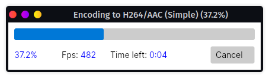

# HanumanInstitute.FFmpeg (FFmpeg.Net)
Cross-platform .Net wrapper for media encoders such as FFmpeg, X264 and X265, including Avisynth and VapourSynth support.

<a href="https://www.nuget.org/packages/HanumanInstitute.FFmpeg/"></a>

## Features
- Manages processes programatically (start, track, cancel).
- Parses process output from FFmpeg, X264 or X265 to track progress and create a rich user interface.
- Provides easy access to common functions, and can be extended to call and track any other console process.
- Can pipe Avisynth and VapourSynth scripts into FFmpeg, X264 and X265 and will manage processes accordingly.
- Can be extended to support additional encoders.
- Fully tested with unit tests so it just works.
- **Works on Windows, Linux and MacOS.**
- Includes cross-platform sample using Avalonia UI.



## Usage without IOC container

1. Create a EncoderService containing the application configuration settings.

2. Use GetMediaEncoder, GetMediaInfoReader, GetMediaMuxer and GetMediaScript on IEncoderService.

3. Call any of the operations such as MediaInfoReader.GetFileInfo.

All operations take 2 parameters: Options and Callback.

**Options** will be explained in ProcessOptions section.

**Callback** plugs into the ProcessStarted event and allows grabbing a reference to ProcessWorker.

```c#
var Service = new EncoderService(Options.Create(new AppPaths() {
    FFmpeg = "ffmpeg-x64" // exclude .exe to work on Linux/MacOS
}));
var InfoReader = Service.GetMediaInfoReader(Factory);
IProcessWorker Worker;
var FileInfo = InfoReader.GetFileInfo("file.mp4", null, (_, e) => Worker = e.ProcessWorker);
```

## Usage with IOC container

1. Register into your IOC container of choice

```c#
SplatRegistrations.RegisterLazySingleton<IEncoderService, EncoderService>();
SplatRegistrations.RegisterConstant(Options.Create(new AppPaths()));
SplatRegistrations.RegisterLazySingleton<IProcessManager, ProcessManager>();
SplatRegistrations.RegisterLazySingleton<IUserInterfaceManager, FFmpegUserInterfaceManager>();
SplatRegistrations.Register<IMediaEncoder, MediaEncoder>();
SplatRegistrations.Register<IMediaMuxer, MediaMuxer>();
SplatRegistrations.Register<IMediaInfoReader, MediaInfoReader>();
SplatRegistrations.Register<IMediaScript, MediaScript>();
```

2. Inject `IMediaEncoder`, `IMediaMuxer`, `IMediaInfoReader` or `IMediaScript` into your class constructor.

3. Set the Owner property.

```c#
private readonly IMediaEncoder _encoder;
private readonly IMediaMuxer _muxer;

public MainViewModel(IMediaMuxer mediaMuxer, IMediaEncoder mediaEncoder)
{
    _encoder = mediaEncoder;
    _encoder.Owner = this;
    _muxer = mediaMuxer;
    _muxer.Owner = this;
}
```

## Configuring Application Paths

EncoderService and ProcessManager take an argument of type `IOptions<AppPaths>`, which is the standard .NET approach to handling configurations. [Read more about Options Pattern in ASP.Net Core.](https://docs.microsoft.com/en-us/aspnet/core/fundamentals/configuration/options?view=aspnetcore-6.0)

Configuring it in a desktop application can be as simple as calling `Options.Create(myAppPaths)` (requires `Microsoft.Extensions.Options`).

If you want to configure the values in `appsettings.json` file, you can do this (ASP.NET loads it automatically but we can do it manually for desktop). Requires `Microsoft.Extensions.Configuration`, `Microsoft.Extensions.Configuration.Json` and `Microsoft.Extensions.Configuration.Binder`.

```c#
var builder = new ConfigurationBuilder()
    .AddJsonFile($"appsettings.json", true, true);
var config = builder.Build();
var paths = config.GetSection("AppPaths").Get<FFmpeg.AppPaths>();

return new EncoderService(Options.Create(paths);
```

## Classes

### IEncoderService (main class)

Creates new instances of process workers. Main entry point to access all process services.

#### Constructor:

IProcessManager: Add your own implementation to alter SoftKill behavior, or to add new applications and paths to be recognized. Or, pass `new ProcessManager()` with AppPaths configuration.

IUserInterfaceManager: Optional. Add your own implementation to display an UI when requested.

IFileInfoParserFactory: Optional. Add your own implementation to parse additional applications.

#### Methods:

IProcessWorker **Create** : Creates a new process worker with specified options.

IProcessWorkerEncoder **CreateEncoder** : Creates a new process worker to run an encoder with specified options.

IMediaEncoder **GetMediaEncoder**: Gets a class exposing methods to encode.

IMediaInfoReader **GetMediaInfoReader**: Gets a class exposing methods to get media information.

IMediaMuxer **GetMediaMuxer**: Gets a class exposing methods to muxe medias.

IMediaScript **GetMediaScript**: Gets a class exposing methods to run Avisynth/Vapoursynth scripts. 

### IMediaInfoReader

Provides functions to get information on media files.

string **GetVersion**() : Returns the version information from FFmpeg.

IFileInfoFFmpeg **GetFileInfo**(string source) : Gets file streams information of specified file via FFmpeg.

long **GetFrameCount**(string source) : Returns the exact frame count of specified video file.

### IMediaMuxer

Provides functions to manage audio and video streams.

CompletionStatus **Muxe**(string videoFile, string audioFile, string destination) : Merges specified audio and video files.

CompletionStatus **Muxe**(IEnumerable<MediaStream> fileStreams, string destination) : Merges the specified list of file streams.

CompletionStatus **ExtractVideo**(string source, string destination) : Extracts the video stream from specified file.

CompletionStatus **ExtractVideo**(string source, string destination : Extracts the video stream from specified file.

CompletionStatus **Concatenate**(IEnumerable<string> files, string destination) : Concatenates (merges) all specified files.

CompletionStatus **Truncate**(string source, string destination, TimeSpan? startPos, TimeSpan? duration = null) : Truncates a media file from specified start position with specified duration. This can result in data loss or corruption if not splitting exactly on a framekey.

### IMediaEncoder

Provides functions to encode media files.

CompletionStatus **ConvertToAviUtVideo**(string source, string destination, bool audio) : Converts specified file into AVI UT Video format.

CompletionStatus **EncodeFFmpeg**(string source, string destination, string videoCodec, string audioCodec, string encodeArgs) : Encodes a media file using FFmpeg with specified arguments.

CompletionStatus **EncodeAvisynthToFFmpeg**(string source, string destination, string videoCodec, string audioCodec, string encodeArgs) : Encodes an Avisynth script file using FFmpeg with specified arguments.

CompletionStatus **EncodeVapourSynthToFFmpeg**(string source, string destination, string videoCodec, string audioCodec, string encodeArgs) : Encodes a VapourSynth script file using FFmpeg with specified arguments.

CompletionStatus **EncodeX264**(string source, string destination, string encodeArgs) : Encodes a media file using X264 with specified arguments.

CompletionStatus **EncodeAvisynthToX264**(string source, string destination, string encodeArgs) : Encodes an Avisynth script file using X264 with specified arguments.

CompletionStatus **EncodeVapourSynthToX264**(string source, string destination, string encodeArgs) : Encodes a VapourSynth script file using X264 with specified arguments.

CompletionStatus **EncodeAvisynthToX265**(string source, string destination, string encodeArgs) : Encodes an Avisynth script file using X265 with specified arguments.

CompletionStatus **EncodeVapourSynthToX265**(string source, string destination, string encodeArgs) : Encodes a VapourSynth script file using X265 with specified arguments.

Note: There is no EncodeX265 because X265 only supports reading RAW and Y4M data and cannot read media files directly.

### IMediaScript

Provides methods to execute Avisynth or VapourSynth media script files.

CompletionStatus **RunAvisynth**(string path) : Runs avs2pipemod with specified source file. The output will be discarded.

CompletionStatus **RunVapourSynth**(string path) : Runs vspipe with specified source file. The output will be discarded.

### IProcessWorker

Executes an application and manages its process.

IMediaConfig **Config** : Gets or sets the configuration settings.

ProcessOptions **Options** : Gets or sets the options to control the behaviors of the process.

ProcessOutput **OutputType** : Gets or sets the console output to read (None | Output | Error).

IProcess **WorkProcess** : Gets the process currently being executed.

event **ProcessStarted** : Gets or sets a method to call after the process has been started.

event **DataReceived** : Occurs when the process writes to its output stream.

event **ProcessCompleted** : Occurs when the process has terminated its work.

string **Output** : Returns the raw console output.

CompletionStatus **LastCompletionStatus** : Returns the CompletionStatus of the last operation.

CompletionStatus **RunAsCommand**(string cmd) : Runs the command as 'cmd /c', allowing the use of command line features such as piping.

CompletionStatus **Run**(string fileName, string arguments) : Runs specified process with specified arguments.

void **Cancel**() : Cancels the currently running job and terminate its process.

string **CommandWithArgs** : Returns the full command with arguments being run.

### IProcessWorkerEncoder

string **EncoderApp** : Gets the application being used for encoding.

ProcessOptionsEncoder **Options** : Gets or sets the options to control the behaviors of the process.

object **FileInfo** : Gets the file information, of type IFileInfoFFmpeg  or IFileInfoX264.

object **LastProgressReceived** : Returns the last progress status data received from DataReceived event, of type ProcessStatusFFmpeg or ProgressStatusX264.

event **FileInfoUpdated** : Occurs after stream info is read from the output.

event **ProgressReceived** : Occurs when progress status update is received through the output stream.

CompletionStatus **RunEncoder**(string arguments, EncoderApp encoderApp) : Runs an encoder process with specified arguments.

CompletionStatus **RunAvisynthToEncoder**(string source, string arguments, EncoderApp encoderApp) : Runs an Avisynth script and encodes it in an encoder process with specified arguments.

CompletionStatus **RunVapourSynthToEncoder**(string source, string arguments, EncoderApp encoderApp) : Runs a VapourSynth script and encodes it in an encoder process with specified arguments.

Note: RunEncoder, RunAvisynthToEncoder and RunVapourSynthToEncoder can also take a string instead of EncoderApp to specify a custom application name. See section "Parsing Custom Application" for more info.

### TimeLeftCalculator

Allows calculating the time left during an encoding process.

long **FrameCount** : Gets or sets the total number of frames to encode.

int **HistoryLength** : Gets or sets the number of status entries to store. The larger the number, the slower the time left will change.

TimeSpan **ResultTimeLeft** : After calling Calculate, returns the estimated processing time left.

double **ResultFps** : After calling Calculate, returns the estimated processing rate per second.

void **Calculate**(long pos) : Calculates the time left and fps. Result will be in ResultTimeLeft and ResultFps.

### UserInterfaceManagerBase

Base class to implement a user interface for running processes.

bool **AppExited** : Gets or sets whether the application has exited.

void **Start**(object jobId, string title) : Starts a user interface that will receive all tasks with the specified jobId.

void **Stop**(object jobId) : Closes the user interface for specified jobId.

void **Display**(IProcessWorker host) : Displays a process to the user.

IUserInterfaceWindow **CreateUI**(string title, bool autoClose) : When implemented in a derived class, creates the graphical interface window.

void **DisplayError**(IProcessWorker host) : When implemented in a derived class, displays an error window.

### IUserInterfaceWindow

Provides an interface that must be implemented by the FFmpeg graphical interface window.

void **Stop**() : Closes the window.

void **DisplayTask**(IProcessWorker host) : Displays specified process.

### ProcessOptions

Contains options to control the behaviors of a process.

ProcessDisplayMode **DisplayMode** : Gets or sets the display mode when running a process (None | Native | Interface | ErrorOnly).  

None : No graphical interface will be created but events can still be handled manually.  
Native : The native FFmpeg console window will be displayed. Events will not be fired.  
Interface : IUserInterfaceManager will be used to display and manage the graphical interface.  
ErrorOnly : IUserInterfaceManager will be used to display the process' output if the process returned an error.  

string **Title** : Gets or sets the title to display.

object **JobId** : Gets or sets an identifier for the job.

bool **IsMainTask** : If displaying several tasks in the same UI, gets whether this is the main task being performed.

ProcessPriorityClass **Priority** : Gets or sets the overall priority category for the associated process.

TimeSpan **Timeout** : Gets or sets a timeout after which the process will be stopped.

### ProcessOptionsEncoder : ProcessOptions

Contains additional options to control the behaviors of an encoder process.

long **FrameCount** : Gets or sets the frame count to use when it is not automatically provided by the input file.

long **TotalFrameCount** : When running several tasks at once, gets or sets the amount of frames for the entire job. If 0, it will be calculated using FrameCount and ResumePos.

long **ResumePos** : If resuming a job, gets or sets the number of frames that were done previously.

## Cancelling Processes

By default, canceling tasks is done with a soft kill to let the process close its files in a clean state. 
**This implementation, however, won't work for Console Applications.** If you are using this class in a 
console application, you must handle MediaConfig.CloseProcess event and implement a work-around as 
described [here](http://stackoverflow.com/a/29274238/3960200); or simply call ProcessWorker.Kill if you don't mind a hard kill.

## Parsing Custom Application

If you want to use an additional application and don't need to parse the process updates, simply use ProcessWorker and don't worry about the output.

If you want to parse the output of an additional application, follow these steps:

1. Create a class that implements IFileInfoParser (see FileInfoX264 for a sample).

2. Create a class that implements IFileInfoParserFactory to support the additional application name which will be identified by a string.

3. When creating your ProcessWorkerFactory, use the overload where you supply all the dependencies to pass your custom IFileInfoParserFactory.

4. Handle `IProcessManager.GetCustomAppPath` event to return the path of the custom application.

5. Call ProcessWorkerEncoder.RunEncoder and specify your custom application name.

## Cool Usages

1. **Avisynth Pause/Resume.** Encoding videos with Avisynth can take a long time, and crashes may occur, or you may
want to use your computer for something else while it is running. The provided interface makes it easy to run 
Avisynth via avs2pipemod and pipe the output to FFmpeg. The user can then click "Cancel" to stop the job in a clean state,
and you can count the number of encoded frames, edit the script to start at that position, and resume from there. 
Once the whole video has been processed, you can use MediaMuxer.Concatenate to merge all the segments and voilà!

2. **Multi-Tasking.** You may need to run several tasks, some in parallel and some in sequence. For example, 
while the video is encoding, you may want to extract the audio to WAV and run OpusEnc or NeroAac to encode the audio in parallel.
Once both the audio and video and done, you then may want to muxe them back together. You can manage that whole process in the
same UI window by first calling FFmpegConfig.UserInterfaceManager.Start with a JobId and calling FFmpegConfig.UserInterfaceManager.End 
when done. All processes started with that JobId will be routed to the same UI. Tasks with IsMainTask will be parsed allowing 
you to display FFmpeg's progress with a progress bar, while tasks with IsMainTask=false will allow displaying 
"Extracting audio", "Encoding Audio" and "Muxing Audio and Video" while those are running in the background. You can also easily
track and cancel the whole chain of commands.

See ExampleApplication to view HanumanInstitute.FFmpeg in action.

### Author

Brought to you by [Etienne Charland aka Hanuman](https://www.spiritualselftransformation.com/). Made by a Lightworker in his spare time.
